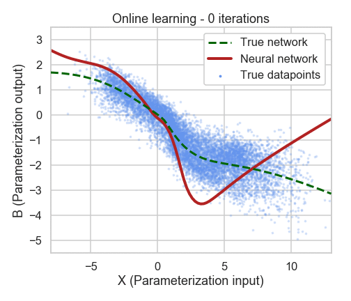

# Online learning as a way to tackle instabilities and biases in machine learning parameterizations

This repository contains all the code for this paper:

The code is (hopefully) easy to understand and runs fast. In fact, you can simply click the [Binder](https://mybinder.readthedocs.io/en/latest/index.html#) ribbon above and launche a cloud instance of the repository to play around with.

If you find this research interesting, I would greatly appreciate any comments, either via [Email](https://raspstephan.github.io/) or with a Github issue in this repo.

Best,
Stephan
